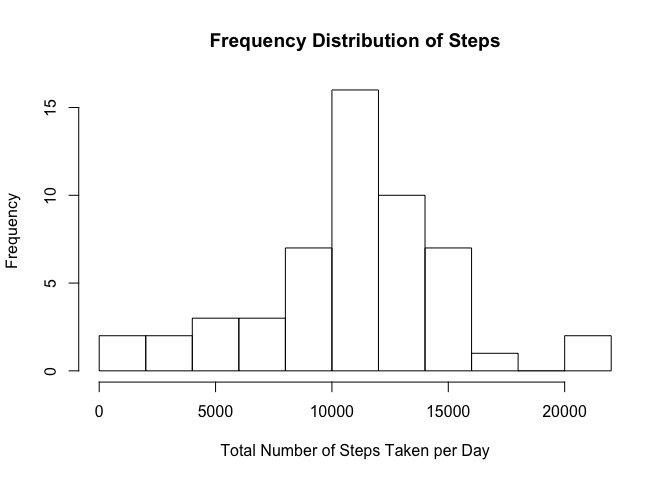
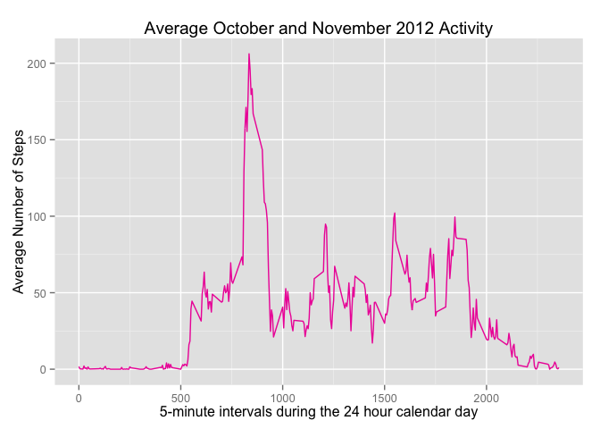
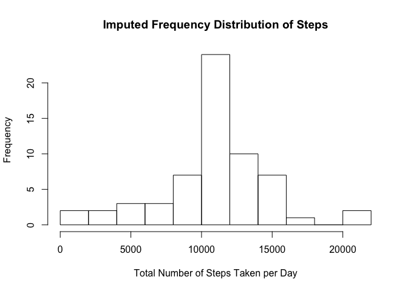
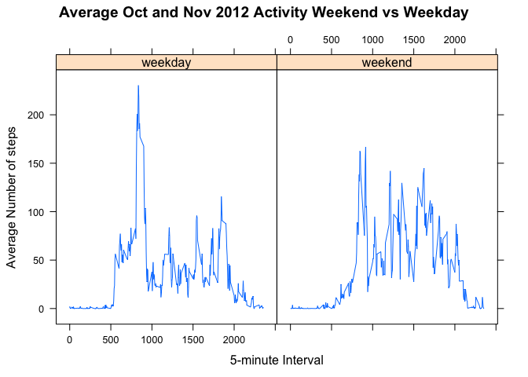

# Reproducible Research: Peer Assessment 1
## Introduction

Created By Leonard Mangini for Coursera Reproducible Research MOOC on May 17, 2015

This is Peer Review Project 1 for Coursera's MOOC on Reproducible Research. The lectures discuss the concept of "Literate Statistical Programming" where the data analyst's text and analysis are "weaved" together in an R MarkDown document with the underlying R code that retrieves, cleans/processes, and analyzes the data, while providing the analyt's observations and conclusions.

This assignment asks us to perform a simple literate programming project by:

- forking the instructor's GitHub repo that contains an R Markdown template for the project
- cloning the forked repo to our local computer
- using the text editor within RStudio to edit this template
- practice good data analysis habits by: documenting the data, retrieving and cleaning the data, performing the requested analyses and answering the questions asked (see below)
- producing a final R Markdown document (rmd file) which contains both our analysis and R Code
- using the knitr "package"" built into RStudio to "weave" the document which creates a markdown file (md file) and an html file from our final R Markdown file
- commiting the three files (rmd md and html) back to GitHub
- Using Coursera's submission page to provide a link to our GitHub Repo
- Using Coursera's submission page to provide the SHA-1 hash for our commit so peer's can review

## Data Description

This project simulates the analysis of personal movement data collected by activity monitoring devices such as Fitbit, Nike Fuelband, and Jawbone Up. We are provided with a sample dataset within the instructor's forked repo that was collected from a personal activity monitoring device at 5 minute intervals through out the day, from an anonymous individual, during October and November 2012.

The variables in this data set include

- steps: the number of steps taken by the individual being monitored during each 5-minute recording interval, with nissing values encoded as NA

- date: the date of the measurement in YYYY-MM-DD format

- interval: an identifier for the specific 5-minute interval during which the activity was meaured

The data format is a "zipped" comma separated value file (csv) with 17,568 observations and the original source can be retrieved form the Coursera class website:

[Dataset] (https://d396qusza40orc.cloudfront.net/repdata%2Fdata%2Factivity.zip)


## Loading and preprocessing the data

As noted in Prof. Peng's lecture, ensure that R code "echoes"" so that it is visible.


```r
echo =TRUE
```

Unzip the zipfile and read the csv file into a dataframe called rawdata. While reading the data set the classes for the dataframe elements to match the data noting that the first column called "number of steps"" is an integer, the second column is a date, and the third column is a factor variable for the 5 minute time interval within that day. 


```r
unzip("activity.zip")
rawdata<- read.csv("activity.csv", colClasses= c("integer", "Date", "factor"))
```

Convert month within data to numeric within rawdata to ease later analysis and graphing.


```r
rawdata$month<- as.numeric(format(rawdata$date, "%m"))
```

Note the number of raw observations is 17568 as was claimed by the instructor's data summary.


```r
nrow(rawdata)
```

```
## [1] 17568
```

Strip out the readings with NA values and store in its own dataframe for "non-NA data" analysis.


```r
data.without.na<-na.omit(rawdata)
```

The remaining dataframe has 15264 rows, indicating that 2304 rows with NA data were removed.


```r
nrow(data.without.na)
```

```
## [1] 15264
```

Name the rows in the cleaned dataframe to make it easier to loop through data


```r
rownames(data.without.na)<-1:nrow(data.without.na)
```

We are asked to make plots, so retrieve the ggplot library.


```r
library(ggplot2)
```

## What is mean total number of steps taken per day?

For this part of the assignment we are asked to ingonore missing/NA data and:

- Calculate the total number of steps taken per day

We use rowsum to sum within each calendar day and place the data in a frame.
We name the frame's second column TotalSteps so any graphs we make are self-documenting.


```r
stepsPerDay<-data.frame(rowsum(data.without.na$steps,format(data.without.na$date,'%Y-%m-%d')))
names(stepsPerDay)<-("Total_Steps_per_Day")
```

- Make a histogram of the total number of steps taken per day


```r
hist(stepsPerDay$Total_Steps_per_Day,main= "Frequency Distribution of Steps", breaks=10,xlab="Total Number of Steps Taken per Day")
```

 

- Calculate and report the mean and median total number of steps taken per day

The mean number of steps per day, excluding NA data, is:


```r
mean(stepsPerDay$Total_Steps_per_Day);
```

```
## [1] 10766.19
```

The median number of steps per day, excluding NA data is:


```r
median(stepsPerDay$Total_Steps_per_Day);
```

```
## [1] 10765
```

The mean is slightly larger than the median which matches the right skew we see in the histogram.


## What is the average daily activity pattern?

- Make a time series plot (i.e. type = "l") of the 5-minute interval (x-axis) and the average number of steps taken, averaged across all days (y-axis)

There are 24*60= 1440 minutes in a day, so there are 288 of these 5-minute intervals. We can use a list of these 288 intervals to apply the mean function within each day across the 2-month study period. The intervals are already named to correspond to a 24-hour clock with 0 as midnight, 500 as 5 in thr morning, 2000 as 8 in the evening and so on. We need to rename our averaging variable so that it is meaningful.

First we find the average number of steps:

```r
avgStepsinInterval <- aggregate(data.without.na$steps, list(interval = as.numeric(as.character(data.without.na$interval))), FUN = "mean")
names(avgStepsinInterval)[2] <- "avgStepsInterval"
```

We create the time series plot showing the average activity of the person through the day.


```r
ggplot(avgStepsinInterval, aes(interval, avgStepsInterval)) + geom_line(color = "maroon2", size = 0.5) + labs(title = "Average October and November 2012 Activity", x = "5-minute intervals during the 24 hour calendar day", y = "Average Number of Steps")
```

 

We see very little activity before 500- so we assume the person probably sleeps until just after 5am. The activity increases and peaks in the morning- perhaps the person actively exercises by walking or even running given the very steep slope and overall height of the activity curve. The person's activity varies around a lower level during the day- perhaps casually walking while doing other things- until just before 2000, or 8pm.  The activity then drops off dramatically as the person seems to be coming home and then going to sleep around 2200, or 10pm.

- Which 5-minute interval, on average across all the days in the dataset, contains the maximum number of steps?

We use the which.max function to retrieve the interval where the maximum occurs.

```r
avgStepsinInterval[which.max(avgStepsinInterval$avgStepsInterval),]
```

```
##     interval avgStepsInterval
## 104      835         206.1698
```

We see that during this 2 month observation period, the subject is averaging more than 206 steps per 5 minutes during the interval starting at 835am. This more than 41 steps per minute which suggests that the subject of our study is walking very quickly or running- that they exercise in the morning.


## Imputing missing values

There are a number of days/intervals with missing data coded as NA which might introduce bias into calculations or summaries so we can attempt to carefully fill in missing data.

- Calculate and report the total number of missing values in the data set- i.e. rows with NA.

We just count the rows in the raw data and subtract the count of rows in the stripped data.


```r
nrow(rawdata) - nrow(data.without.na)
```

```
## [1] 2304
```

We see that 2304 of the 17568 data points have missing data.


- Devise a strategy for filling in all of the missing data- it does not need to be sophisticated.

I have chosen to use the mean value of the available data for each5-minute intervals with missing data. This should not bias the data since the "good" part of the sample is 86.88% of the total observation points. This makes more sense then using the mean from a different part of the day since the subject's activity varies a lot, especially when they are exercising in the morning. With so many data points the mean and median should not be far apart and even though calculating medians would prevent adding the impact of some outliers, calculating medians is more complicated. 


- Create a new data set equal to the original but with the missing data filled in.

The data frame used to make the histogram above already has the interval averages we want to use as the replacement values. So we just need to loop through the new data testing for NA values and replacing each one as we go with the corresponding averages that were already stored.


```r
imputed.data<-rawdata
for (i in 1:nrow(imputed.data)) {
  if (is.na(imputed.data$steps[i])) {
    imputed.data$steps[i]<-avgStepsinInterval[which(imputed.data$interval[i]==avgStepsinInterval$interval),]$avgStepsInterval
  }
}
```

- Make a histogram of total steps per day ands calculate the mean and median using this new dataset with the imputed values. Do these differ from the first part of the project above? What is the impact of imputing missing data on the estimates?

We count up by day in the new dataset just like we did before using variables with imputed in their names so we can tell them apart.


```r
imputedstepsPerDay<-data.frame(rowsum(imputed.data$steps,format(imputed.data$date,'%Y-%m-%d')))
names(imputedstepsPerDay)<-("imputedTotal_Steps_per_Day")
```

We then draw the histogram using the imputed data


```r
hist(imputedstepsPerDay$imputedTotal_Steps_per_Day,main= "Imputed Frequency Distribution of Steps", breaks=10,xlab="Total Number of Steps Taken per Day")
```

 

And we find the mean and median using the same R commands but on the new "imputed" data set.


```r
mean(imputedstepsPerDay$imputedTotal_Steps_per_Day);
```

```
## [1] 10766.19
```

The median number of steps per day, excluding NA data is:


```r
median(imputedstepsPerDay$imputedTotal_Steps_per_Day);
```

```
## [1] 10766.19
```

We see that the new mean is exactly the same, 10766.19 as it was before- as we would expect since we used the mean as the imputed value to replace NAs.

We see the median has increased from 10765 to 10766.19 and now happens to be the same as the mean.
This is a very minor difference. It was not a surprise that the median would go up after we imputed values since the new imputed values we added were all equal to the mean which was higher then the previous median. It surprised me a little that the mean and median after imputing data are now the same, but that just shows how tightly clustered the activity data we have been observing really is.


## Are there differences in activity patterns between weekdays and weekends?

Using the new data set with filled in missing data, analyze the weekday versus weekend activity.

- Using the weekdays() function, create a new factor variable in the imputed dataset with two levels- "weekday" and "weekend" indicating for the calendar date of the observation.

This new varibale can be set with an ifelse statement to pick the correct level of the new factor.


```r
imputed.data$weekendflag<-as.factor(ifelse(weekdays(imputed.data$date) %in% c("Saturday","Sunday"), "weekend","weekday"))
```


- Make a panel plot containing a time series plot with the 5-minute intervals on the x-axis and average number of steps across weekday days and weekend days on the y-axis. Does the subject of the observation have different activity patterns during the week and during the weekend?

First we must calculate the average steps for the imputed dataset with two levels of the "weekend indicator variable". We can use the same R commands as we did above to make the first time series plot but just adding the weekend flag indicator variable as a parameter. This creates 576 averages, 24*60/5=288 for the intervals during the week and 288 for the intervals during the weekend.


```r
imputedavgStepsinInterval <- aggregate(imputed.data$steps, list(interval = as.numeric(as.character(imputed.data$interval)),weekendflag=imputed.data$weekendflag), FUN = "mean")
names(imputedavgStepsinInterval)[3] <- "imputedavgStepsInterval"
```

We can use the R "lattice" plotting library to create panel plots.


```r
library(lattice)
panelplot<-xyplot(imputedavgStepsinInterval$imputedavgStepsInterval ~ imputedavgStepsinInterval$interval | imputedavgStepsinInterval$weekendflag, 
       layout = c(2, 1), type = "l", main= "Average Oct and Nov 2012 Activity Weekend vs Weekday", 
       xlab = "5-minute Interval", ylab = "Average Number of steps")
print(panelplot)
```

 

Looking at the 2 plots we can see that the subject wakes up from sleeping at about the same time on weekends as during the week, is less active on the weekend right after first getting up, exercises less intensely between 8am and 9am then during the week, but is then almost two times as active all day long then during the week. The subject still becomes very inactive after 2000/8pm and seems to go to sleep at about the same time on the weekend as during the week.
